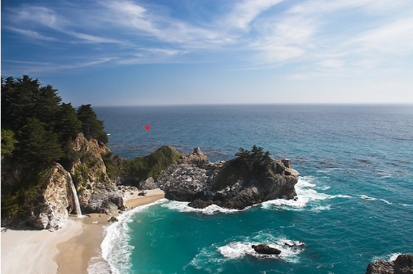
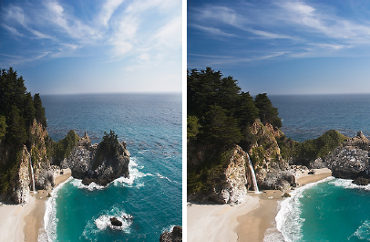

# 选项1：图像的接缝裁剪

## 目录

- [选项1：图像的接缝裁剪](#选项1图像的接缝裁剪)
  - [目录](#目录)
  - [引言](#引言)
  - [实验要求](#实验要求)
  - [MATLAB 框架](#matlab-框架)
    - [运行方式](#运行方式)
    - [需要完成的代码](#需要完成的代码)
  - [Python 框架](#python-框架)
    - [环境配置](#环境配置)
    - [文件结构](#文件结构)
    - [运行方式](#运行方式-1)
    - [需要完成的代码](#需要完成的代码-1)

## 引言

打开 bing 浏览器首页并全屏，你会看到类似于下图的首页背景图片

<p align="center">
    
</p>

这时候如果你改变浏览器窗口的大小（比如缩小窗口的长度），你会看到首页背景图片变成下下面这样

<p align="center">
    
</p>

如你所料，背景图片的尺寸随着窗口大小发生变化。但仔细观察，不难发现**这两张图片并不是简单的裁剪（chopping）或者缩放（rescaling）的关系**。

事实上，在图像处理领域，常常会遇到需要改变给定图像的长宽比例，同时保留原始图片信息的情形（如在网页中插入的图片，需要灵活地根据用户当前浏览页面的长宽比来调整插入图片的长宽比）。

例如，对于下面的图片，如何将其长度缩小为原来的一半同时保留其主要信息呢？

<p align="center">
    
</p>

最 naive 的想法是截取图像的半边，或者对图像做线性伸缩。其结果如下图所示。

<p align="center">
    
</p>
<p style="text-align: center; font-size: 12px; color: #666;">左图：将原始图像的长度线性伸缩为原来的一半的结果；右图：对原始图像截取左半侧的结果</p>

可以看到，我们确实达到了改变图像长宽比例的要求。但是原始图像的主要信息并没有得到充分保留：
- 对于左图，由于图像整体的长度被压缩，可以明显看到山丘和树木存在畸变；
- 对于右图，由于只截取了左半边，右半边的海角和礁石的信息没有得到保留

那么我们如何才能实现如下图所示的**既能改变长宽比例，又能尽可能多地保留图像信息**呢？

<p align="center">
    
</p>
<p style="text-align: center; font-size: 12px; color: #666;">Seam Carving的结果：图像的主要信息得到了保留。</p>

## 实验要求

实现 2007 年 ToG 论文 [Seam Carving for Content-Aware Image Resizing](https://dl.acm.org/doi/10.1145/1276377.1276390) 中的接缝裁剪算法，用以改变图像的长宽比例。

实验报告中请展示如下内容：
- 简述算法的基本原理
- 展示图片裁剪的结果（缩小图片的长度、宽度）
- 对比实验：文中的方法与其他方法的对比（如截断、伸缩等）
- 对实验结果的必要说明

实现说明：
- 本次作业提供了 `MATLAB` 和 `Python` 两套程序框架，可任选其一
- 本次实验不限制编程语言，但如果你不打算使用提供的框架，请自行搭建类似的图形界面
- 如果你有新解法或其他方面的创新，欢迎在报告中呈现

> 作为练习，我们鼓励大家完成论文中除接缝裁剪外的其他应用（如 Image Enlarging, Content Amplification, etc）

## MATLAB 框架

### 运行方式

在 MATLAB 中打开 `code_template/seam_carving.m`，直接运行即可。程序会启动一个图形界面，左侧显示原始图像，右侧显示裁剪结果。点击工具栏上的蓝色按钮即可触发 Seam Carving 裁剪（默认将图像宽度缩小 300 像素）。

### 需要完成的代码

请打开 `code_template/seam_carving.m`，补全 `seam_carve_image` 函数中标有 `TODO` 的部分：

| 步骤 | 说明 |
|------|------|
| 计算能量图 | 已提供 `costfunction`，利用 Laplacian 滤波器计算每个像素的能量值 |
| 寻找最优接缝 | 在能量图 `G` 上，使用动态规划找到一条从顶部到底部的最小能量路径（seam） |
| 移除接缝 | 将找到的 seam 从图像 `im` 中移除，使图像宽度减少 1 像素 |

框架中已提供的能量函数为：

$$e(x, y) = \sum_{c \in \{R,G,B\}} \left( \nabla^2 I_c(x, y) \right)^2$$

其中 $\nabla^2$ 为 Laplacian 算子，`costfunction` 使用 `[.5 1 .5; 1 -6 1; .5 1 .5]` 滤波核近似。每次迭代移除一条 seam，循环 `k` 次即可将图像宽度缩小 `k` 像素。

## Python 框架

我们也提供了一个 Python 实现框架，功能与 MATLAB 框架等价。

### 环境配置

推荐使用 [Miniforge](https://conda-forge.org/download/) 管理 Python 环境。

使用 conda 创建并激活环境：

```bash
conda create -n mm26 python=3.12
conda activate mm26
pip install numpy matplotlib scikit-image scipy
```

### 文件结构

```
code_template/
├── seam_carving.py      # Python 框架（需要补全）
└── seam_carving.m       # MATLAB 框架（需要补全）
```

### 运行方式

```bash
conda activate mm26
cd code_template
python seam_carving.py
```

运行后弹出 matplotlib 窗口，左侧显示原始图像，右侧显示裁剪结果。通过两个滑动条分别设置列（宽度）和行（高度）的缩放比例（0.5~2.0），点击 **Seam Carving** 按钮即可触发裁剪/放大。

### 需要完成的代码

请打开 `code_template/seam_carving.py`，补全标有 `TODO` 的 `seam_carve_image` 函数。该函数与 MATLAB 版本的接口完全一致：

| 函数 | 说明 |
|------|------|
| `seam_carve_image(im, sz)` | 输入原始图像 `im` 和目标尺寸 `sz = (target_h, target_w)`，返回调整后的图像 |

完成后，运行 `python seam_carving.py` 即可验证结果。欢迎进一步优化或实现更多功能。

```python
## TODO: implement function: seam_carve_image
def seam_carve_image(im, sz):
    """
    Seam carving 实现：将图像 im 调整至目标尺寸 sz (h, w)
    参考 MATLAB 模板逻辑：使用 Laplacian 能量函数和动态规划
    """
    import time
    start_time = time.time()
    
    # 转换为 float64 以防计算能量时溢出
    out = im.astype(np.float64)
    target_h, target_w = sz
    h, w = out.shape[:2]

    # 定义实验要求的 costfunction (核函数)
    # kernel = [.5 1 .5; 1 -6 1; .5 1 .5]
    kernel = np.array([[.5, 1, .5], 
                       [1, -6, 1], 
                       [.5, 1, .5]])

    def get_energy(img):
        # 对应 MATLAB: sum( imfilter(im, kernel).^2, 3 )
        energy = np.zeros((img.shape[0], img.shape[1]))
        for i in range(3):
            # 使用 constant 填充对应 MATLAB 默认行为
            res = convolve(img[:, :, i], kernel, mode='constant')
            energy += res**2
        return energy

    # 1. 调整宽度 (移除垂直接缝)
    k_cols = w - target_w
    for _ in range(k_cols):
        G = get_energy(out)
        r, c = G.shape
        
        # M 计算路径代价 (对应 MATLAB 的 M 矩阵)
        M = G.copy()
        # backtrack 记录路径，用于回溯
        backtrack = np.zeros((r, c), dtype=int)
        
        # 矢量化加速优化：替代原 MATLAB 的 inner for loop (col = 1:c)
        # 这能极大提高 Python 运行速度，防止 GUI 卡死
        for row in range(1, r):
            prev_row = M[row-1]
            # 构造三个位移后的数组，分别代表左上、正上、右上
            left = np.r_[np.inf, prev_row[:-1]]
            mid = prev_row
            right = np.r_[prev_row[1:], np.inf]
            
            # 找到三个方向的最小值
            stacked = np.stack([left, mid, right])
            best_idx = np.argmin(stacked, axis=0) # 0:左, 1:中, 2:右
            M[row] += np.min(stacked, axis=0)
            
            # 记录回溯路径 (相对偏移转绝对索引)
            backtrack[row] = np.arange(c) + (best_idx - 1)
            # 修正边界：防止索引超出范围
            backtrack[row] = np.clip(backtrack[row], 0, c - 1)

        # 找到最后一行最小代价的起点
        j = np.argmin(M[-1, :])
        
        # 生成掩码移除接缝
        mask = np.ones((r, c), dtype=bool)
        for row in range(r - 1, -1, -1):
            mask[row, j] = False
            j = backtrack[row, j]
        
        # 更新图像
        out = out[mask].reshape(r, c - 1, 3)

    # 2. 调整高度 (如有需要，通常通过转置复用上述逻辑)
    if out.shape[0] > target_h:
        # 这里逻辑与上方一致，为简洁起见可递归或重复，但最简单是转置处理
        out = np.transpose(out, (1, 0, 2))
        # ... 重复上述逻辑 (此处略，实际作业中若需缩减高度可按此法添加)
        out = np.transpose(out, (1, 0, 2))

    print(f"程序运行时间为 {time.time() - start_time:.2f} 秒")
    return np.clip(out, 0, 255).astype(np.uint8)
```