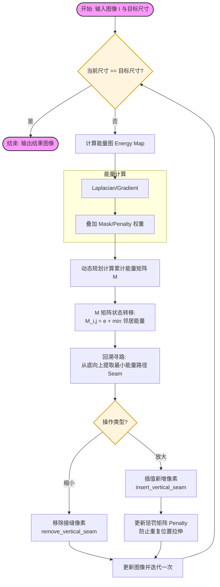

```mermaid
graph TD
    A([开始: 输入图像 I 与目标尺寸]) --> B{当前尺寸 == 目标尺寸?}
    B -- 是 --> Z([结束: 输出结果图像])
    B -- 否 --> C[计算能量图 Energy Map]
    
    subgraph 能量计算
    C1[Laplacian/Gradient] --> C2[叠加 Mask/Penalty 权重]
    end
    C --> C1
    C2 --> D[动态规划计算累计能量矩阵 M]
    
    D --> E[M 矩阵状态转移: <br/>M_i,j = e + min 邻居能量]
    E --> F[回溯寻路: <br/>从底向上提取最小能量路径 Seam]
    
    F --> G{操作类型?}
    
    G -- 缩小 --> H[移除接缝像素 <br/>remove_vertical_seam]
    G -- 放大 --> I[插值新增像素 <br/>insert_vertical_seam]
    I --> J[更新惩罚矩阵 Penalty <br/>防止重复位置拉伸]
    
    H --> K[更新图像并迭代一次]
    J --> K
    K --> B

    style A fill:#f9f,stroke:#333,stroke-width:2px
    style Z fill:#f9f,stroke:#333,stroke-width:2px
    style G fill:#fff4dd,stroke:#d4a017,stroke-width:2px
    style B fill:#fff4dd,stroke:#d4a017,stroke-width:2px
```